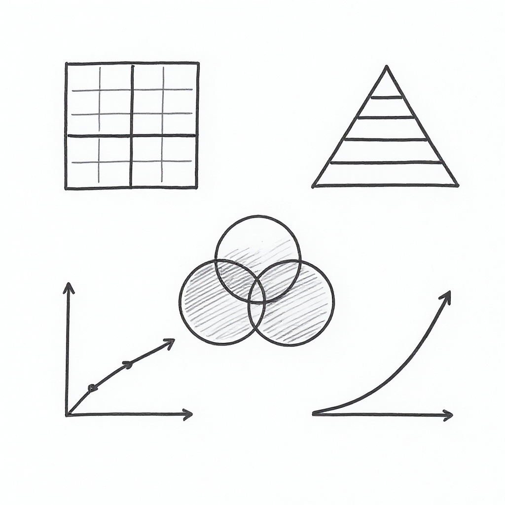

# AI-Driven Business Innovation

## Strategic Frameworks Reference Sheet

**Executive Education**
Curtin Business School

---

*Your quick-reference guide to the five strategic frameworks*

## Five Strategic Frameworks

This reference sheet provides quick access to the five frameworks taught in the AI-Driven Business Innovation Masterclass.

### What You'll Find:

**Framework 1: AI Transformation Matrix**
- Classify AI initiatives by strategic value
- Four quadrants: Optimize, Enhance, Revolutionize, Transform

**Framework 2: Data Value Pyramid**
- Assess your organization's data maturity
- Five levels from collection to autonomous operations

**Framework 3: Three Horizons Model**
- Balance your AI portfolio across time horizons
- Manage current operations while building the future

**Framework 4: AI Investment Model**
- Evaluate AI proposals systematically
- Strategic fit, feasibility, ROI, and risk assessment

**Framework 5: Innovation Adoption Framework**
- Understand barriers to AI adoption
- Plan for organisational change management

---

### How to Use This Guide

**During the workshop:**
- Keep this on your desk for quick reference
- Use it during exercises to apply frameworks
- Annotate with your own insights and notes

**After the workshop:**
- Pin near your workspace
- Reference when evaluating AI opportunities
- Share with colleagues on your AI team

---

**🌐 Digital Version:** https://exec-ed.github.io/ai-business-innovation/

**📧 Questions:** michael.borck@curtin.edu.au

## Framework 1: AI Transformation Matrix

**Purpose:** Classify AI initiatives to understand strategic value

**Two Dimensions:**

### Dimension 1: Focus
- **Process Focused:** Automate/optimize existing processes (efficiency)
- **Strategic Focused:** New capabilities, products, business models (differentiation)

### Dimension 2: Magnitude
- **Incremental:** Improve what exists (10-30% improvement)
- **Transformational:** Fundamentally change how business operates (10x change)

**Four Quadrants:**

| | Incremental | Transformational |
|---|---|---|
| **Process** | **Optimize** - Automate tasks, reduce costs | **Revolutionize** - Reinvent core processes |
| **Strategic** | **Enhance** - Improve products/services | **Transform** - New business models |

**Examples:**
- **Optimize:** Automate invoice processing, chatbot for FAQs
- **Enhance:** AI product recommendations, personalised marketing
- **Revolutionize:** Fully autonomous supply chain, lights-out manufacturing
- **Transform:** AI-as-a-Service new revenue stream, platform business model

**Use this when:** Prioritizing AI initiatives in your portfolio

---

## Framework 2: Data Value Pyramid

**Purpose:** Understand data maturity and AI readiness

**Five Levels (bottom to top):**

### Level 1: Data Collection
- Raw data from systems
- **Example:** Transaction logs, sensor data, customer interactions

### Level 2: Data Integration
- Connected data from multiple sources
- **Example:** Customer 360 view, unified inventory system

### Level 3: Descriptive Analytics
- "What happened?"
- **Example:** Dashboards, reports, KPIs

### Level 4: Predictive Analytics
- "What will happen?"
- **Example:** Demand forecasting, churn prediction, maintenance alerts

### Level 5: Prescriptive Analytics / Autonomous Operations
- "What should we do?" → System acts automatically
- **Example:** Dynamic pricing, auto-replenishment, self-optimizing systems

**Key Insight:** You can't skip levels. AI requires strong data foundations.

**Use this when:** Assessing organisational readiness for AI initiatives

---

## Framework 3: Three Horizons Model

**Purpose:** Balance AI portfolio across timeframes

### Horizon 1: Optimize the Core (70% of investment)
- **Timeframe:** 0-12 months
- **Goal:** Improve current business
- **AI Examples:** Process automation, chatbots, predictive maintenance
- **ROI:** Quick, measurable, low risk

### Horizon 2: Build Emerging Business (20% of investment)
- **Timeframe:** 1-3 years
- **Goal:** Develop new capabilities
- **AI Examples:** AI-enhanced products, new customer experiences, platform services
- **ROI:** Medium term, moderate risk

### Horizon 3: Create the Future (10% of investment)
- **Timeframe:** 3-5+ years
- **Goal:** Transformational innovation
- **AI Examples:** New business models, AI-native ventures, autonomous operations
- **ROI:** Long term, higher risk, potential for breakthrough

**Portfolio Balance:**
- Too much H1: Short-term thinking, miss opportunities
- Too much H3: Burning cash on uncertain futures
- **Sweet spot:** 70/20/10 allocation (adjust for industry)

**Use this when:** Building your AI investment portfolio

---

## Framework 4: AI Investment Model

**Purpose:** Calculate ROI and make data-driven investment decisions

### Value Categories

**1. Cost Reduction**
- Labour savings from automation
- Efficiency improvements
- Error reduction

**2. Revenue Growth**
- New products/features enabled by AI
- Better conversion rates
- Premium pricing for AI-enhanced offerings

**3. Risk Reduction**
- Fraud detection savings
- Compliance automation
- Better decision-making reduces costly mistakes

**4. Strategic Positioning**
- Competitive advantage
- Market share gains
- Option value (platform for future initiatives)

### Investment Calculation

**Total Value = Cost Reduction + Revenue Growth + Risk Reduction + Strategic Value**

**ROI = (Total Value - Investment Cost) / Investment Cost × 100%**

### Evaluation Criteria

**Minimum thresholds:**
- **Horizon 1 initiatives:** ROI > 200% in Year 1
- **Horizon 2 initiatives:** ROI > 150% over 3 years
- **Horizon 3 initiatives:** ROI > 100% over 5 years (or strategic must-have)

**Risk-adjusted:**
- Low confidence in value → require higher ROI
- High certainty → accept lower ROI

**Use this when:** Evaluating competing AI investment proposals

---

## Framework 5: Innovation Adoption Framework

**Purpose:** Implement AI strategically across the organisation

### Phase 1: Knowledge Building (3-6 months)
- **Activities:** Education, workshops, vendor briefings, pilot identification
- **Goal:** Build literacy and identify opportunities
- **Investment:** Low (1-5% of AI budget)

### Phase 2: Pilot Experimentation (6-12 months)
- **Activities:** Small pilots, proof-of-concepts, learn by doing
- **Goal:** Validate technical feasibility and business value
- **Investment:** Medium (10-20% of AI budget)

### Phase 3: Selective Deployment (12-18 months)
- **Activities:** Scale successful pilots, build capability, early production deployments
- **Goal:** Deliver initial business value
- **Investment:** Growing (30-40% of AI budget)

### Phase 4: Scaling Operations (18-36 months)
- **Activities:** Broader rollout, platform building, centre of excellence
- **Goal:** Systematic value delivery
- **Investment:** Peak (40-50% of AI budget)

### Phase 5: Comprehensive Transformation (36+ months)
- **Activities:** AI-native processes, continuous innovation, ecosystem partnerships
- **Goal:** AI as core competency
- **Investment:** Sustained (30-40% of AI budget, shifts to R&D)

**Key Insight:** Most organisations fail by trying to skip to Phase 4/5. Respect the journey.

**Use this when:** Planning multi-year AI transformation

---

## Quick Decision Framework

When evaluating any AI initiative, ask:

### 1. Classification (Transformation Matrix)
- [ ] Where does this sit: Optimize, Enhance, Revolutionize, or Transform?
- [ ] Is this the right type of initiative for our strategy?

### 2. Data Readiness (Data Value Pyramid)
- [ ] What level are we at today?
- [ ] What level does this initiative require?
- [ ] Can we bridge the gap?

### 3. Portfolio Balance (Three Horizons)
- [ ] Which horizon is this in?
- [ ] Does our portfolio balance need this?
- [ ] Are we over-invested in one horizon?

### 4. Investment Return (AI Investment Model)
- [ ] What's the total value across all categories?
- [ ] What's the ROI?
- [ ] Does it meet our threshold?

### 5. Implementation Readiness (Innovation Adoption)
- [ ] What phase are we in organizationally?
- [ ] Is this initiative appropriate for our maturity?
- [ ] What capabilities do we need to build?

**If you can't clearly answer these 5 questions, you're not ready to invest.**

---

## Common Strategic Mistakes to Avoid

**Mistake 1: AI for AI's Sake**
- ❌ Wrong: "We need to do AI because everyone else is"
- ✅ Right: "This AI initiative solves business problem X and delivers ROI of Y"

**Mistake 2: Skipping Data Foundations**
- ❌ Wrong: "Let's jump straight to AI"
- ✅ Right: "First fix data quality, then build analytics, then AI"

**Mistake 3: All Horizon 1 (Short-term thinking)**
- ❌ Wrong: 100% investment in quick wins
- ✅ Right: 70/20/10 balance across horizons

**Mistake 4: All Horizon 3 (Moonshots only)**
- ❌ Wrong: "We're building AGI and reinventing the industry"
- ✅ Right: Mix of quick wins, growth, and transformation

**Mistake 5: No ROI Discipline**
- ❌ Wrong: "It's strategic, we can't quantify the value"
- ✅ Right: "Here's the value across 4 categories, here's the ROI calculation"

**Mistake 6: Trying to Scale Before Piloting**
- ❌ Wrong: Phase 1 → Phase 4 (skip learning)
- ✅ Right: Follow all 5 phases, earn your way to scale

---

## Integration: How the Frameworks Work Together

**Strategic Planning Process:**

1. **Assess current state** (Data Value Pyramid)
   - Where is our data maturity?

2. **Classify opportunities** (AI Transformation Matrix)
   - What types of initiatives are we considering?

3. **Balance portfolio** (Three Horizons Model)
   - Do we have the right mix across timeframes?

4. **Evaluate investments** (AI Investment Model)
   - Which initiatives have best ROI?

5. **Plan implementation** (Innovation Adoption Framework)
   - What phase are we in? What's next?

**Decision-Making Process:**

For each AI proposal:
- Classify it (Matrix)
- Check data readiness (Pyramid)
- Assign to horizon (Three Horizons)
- Calculate ROI (Investment Model)
- Validate against maturity (Adoption Framework)
- **Then decide:** Fund, defer, or reject

---

## Your Action Plan

**This week:**
1. Map your current AI initiatives on the Transformation Matrix
2. Assess your data maturity on the Value Pyramid
3. Calculate portfolio balance across Three Horizons

**This month:**
1. Evaluate top 3 AI proposals using the Investment Model
2. Identify what phase you're in on the Adoption Framework
3. Make portfolio rebalancing decisions

**This quarter:**
1. Build AI governance using these frameworks
2. Train leadership team on the frameworks
3. Implement decision criteria for all AI investments

---

**These frameworks are tools, not rules. Adapt them to your context, but use them consistently to make better strategic decisions about AI investments.**

## Quick Reference Summary

### When to Use Each Framework:

**🎯 AI Transformation Matrix**
- **Use when:** Prioritizing AI initiatives in your portfolio
- **Question it answers:** "Where does this initiative fit strategically?"
- **Output:** Classification (Optimize/Enhance/Revolutionize/Transform)

**📊 Data Value Pyramid**
- **Use when:** Assessing organisational AI readiness
- **Question it answers:** "Are we ready for this AI initiative?"
- **Output:** Current data maturity level (1-5)

**🔭 Three Horizons Model**
- **Use when:** Building a balanced AI portfolio
- **Question it answers:** "Are we investing across all time horizons?"
- **Output:** Portfolio distribution (H1/H2/H3)

**💰 AI Investment Model**
- **Use when:** Evaluating specific AI proposals
- **Question it answers:** "Should we fund this AI project?"
- **Output:** Go/No-Go decision with rationale

**🚀 Innovation Adoption Framework**
- **Use when:** Planning AI implementation
- **Question it answers:** "What barriers will we face and how do we overcome them?"
- **Output:** Change management plan

---

### Common Mistakes to Avoid

❌ **Don't:** Only invest in Horizon 1 (Optimize)
✅ **Do:** Balance portfolio across all three horizons

❌ **Don't:** Skip data readiness assessment
✅ **Do:** Check Data Value Pyramid before committing resources

❌ **Don't:** Evaluate AI in isolation
✅ **Do:** Use all frameworks together for comprehensive view

❌ **Don't:** Ignore adoption barriers
✅ **Do:** Plan for change management from the start

---

### Additional Resources

**Digital Materials:**
- 🌐 **Website:** https://exec-ed.github.io/ai-business-innovation/
- 📊 **Interactive Tools:** AI Investment Checklist, ROI Calculator
- 📚 **Prompt Library:** 1000+ strategic AI prompts
- 🎯 **Leadership Assessment:** Evaluate your AI readiness

**Further Reading:**
- AI Metrics and ROI Indicators
- LLM and AI Agents Strategic Guide
- Five Key AI Capability Domains
- Future AI Trend Analysis

**Stay Connected:**
- 📧 **Email:** michael.borck@curtin.edu.au
- 💼 **LinkedIn:** [Your LinkedIn]

---

*Framework designs © 2024 Curtin University | Executive Education*

---

    

**Strategic Frameworks Reference Sheet**

AI-Driven Business Innovation Masterclass

---

*Your guide to strategic AI decision-making*

    

**Executive Education | Curtin Business School**

📧 michael.borck@curtin.edu.au

🌐 https://exec-ed.github.io/ai-business-innovation/

---

© 2024 Curtin University

