# Companion Site

*Scan QR code for quick access to digital materials:*

# The Question We'll Answer

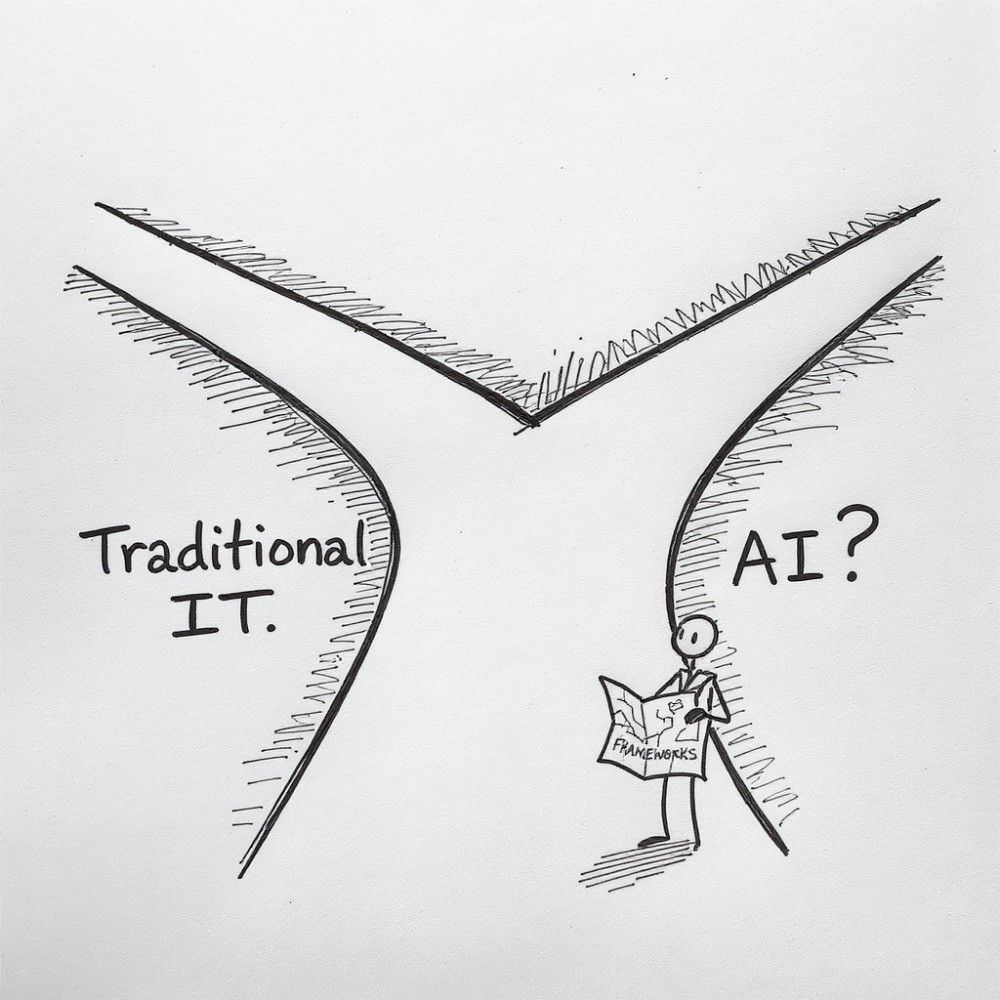

::: {.notes}
**How is evaluating AI investments DIFFERENT from traditional IT investments?**

By end of day, you'll know:

- 5 ways AI differs from traditional IT
- 5 AI-specific evaluation criteria
- Why highest ROI ≠ best AI investment

:::

---

# Today's Schedule

**Morning Session:**

- What Makes AI Different
- Exercise 1: AI Tech Radar
- Strategic Frameworks
- Exercise 2: AI-Assisted Strategic Analysis

**Afternoon Session:**

- AI Investment Model
- Exercise 3: Dragon's Den
- Exercise 4: Strategic Response Scenarios
- Debrief & Action Planning

---

# Traditional vs. AI

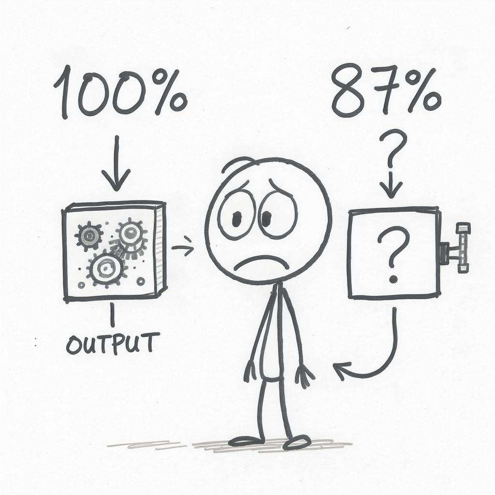

::: {.notes}

Traditional IT | AI
---------------|----
Deterministic | Probabilistic
Works without data | Useless without data
Build once, maintain | Continuous learning
Traceable decisions | Black box
Human bias | Amplified bias at scale

**Implication:** AI needs DIFFERENT evaluation criteria

:::

---

# 1. Data Dependency

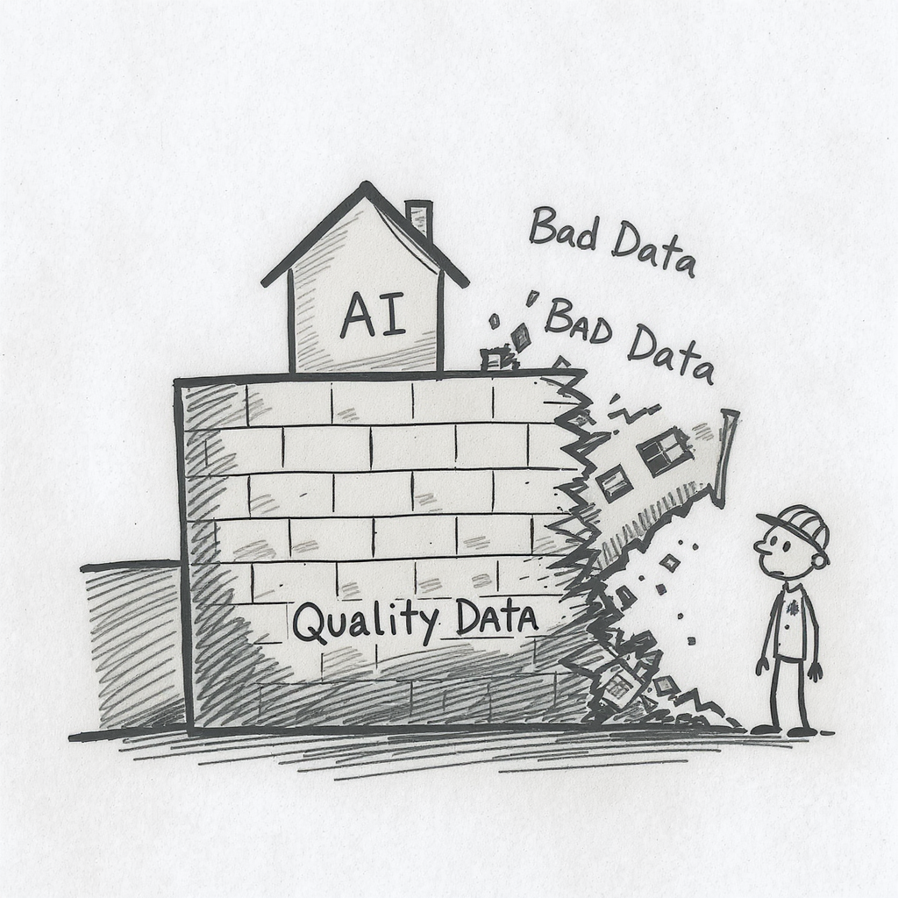

::: {.notes}

**Traditional IT:**

- Write code based on business rules
- Works regardless of data quality

**AI:**

- Learns patterns from historical data
- Quality = Data Quality × Algorithm

**Before funding AI:** Assess data readiness (0-10 score, need 7+)
:::

---

# 2. Continuous Learning

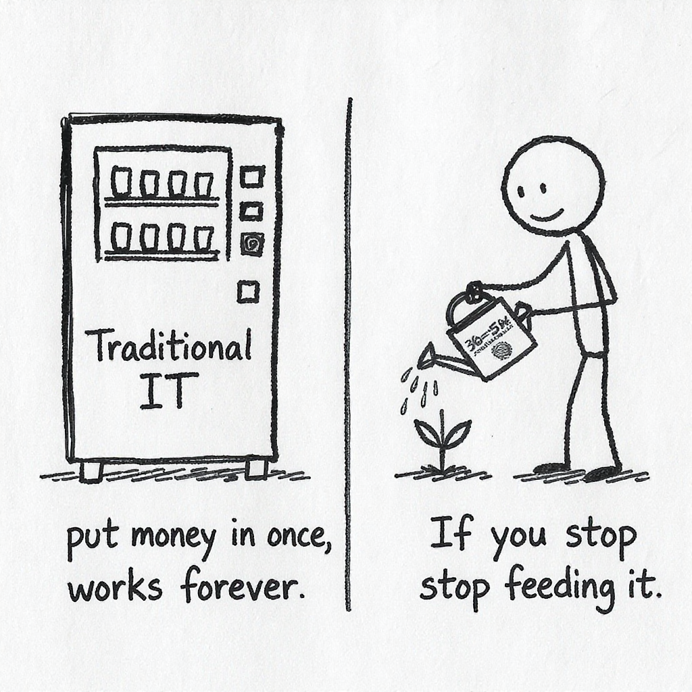

::: {.notes}
**Traditional IT:**

- Build once, maintain 10-15% annually
- Predictable costs

**AI:**

- Continuous retraining as world changes
- Ongoing costs: **30-50% annually**

**Calculate 5-year TCO, not just Year 1 cost**

:::

---

# 3. Probabilistic Nature

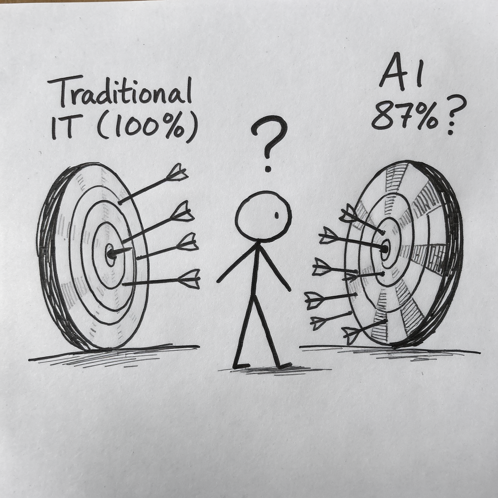

::: {.notes}
**Traditional IT:** Same input = same output (100%)

**AI:** "I'm 87% confident customer will churn"

Match AI accuracy to business risk tolerance:

- **Low stakes** (recommendations): 70-80% OK
- **Medium stakes** (operations): 85-95% needed
- **High stakes** (medical, financial): 95-99%+ required
:::

---

# 4. Black Box Problem

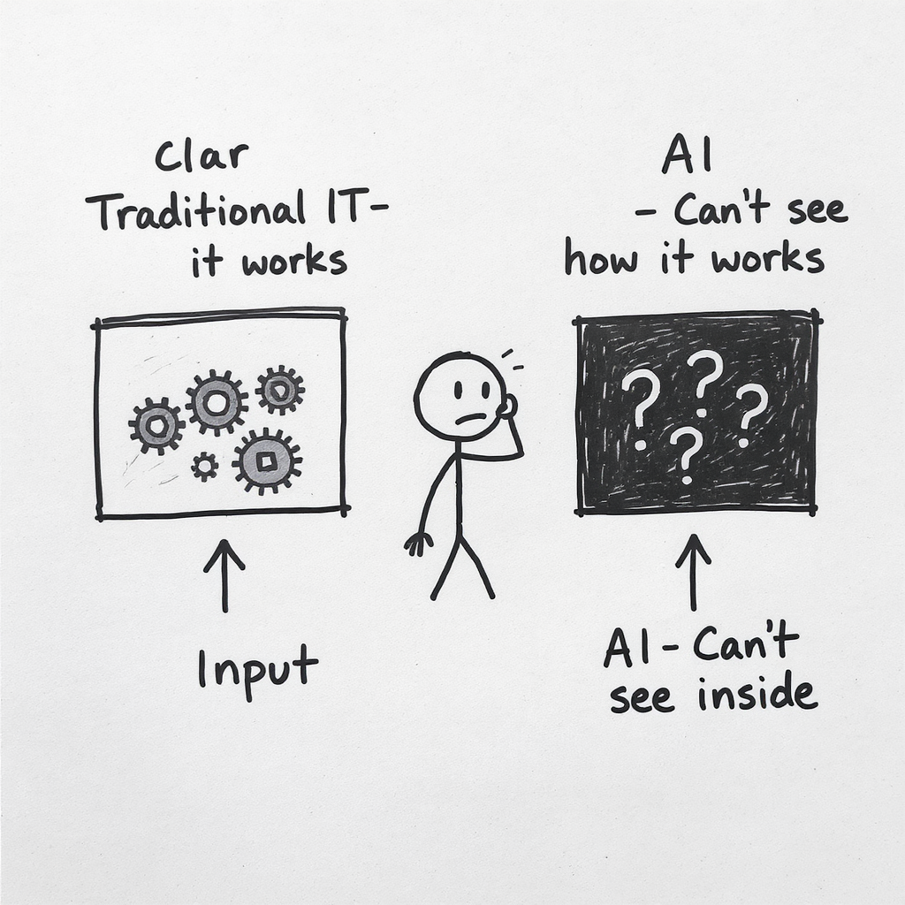

::: {.notes}
**Traditional IT:**

- Trace every decision
- Developers explain "why"

**AI (especially deep learning):**

- Input → **Black Box** → Output
- "The model learned that pattern"

High explainability = Limited algorithms + Higher cost (+15-20%)

:::

---

# 5. Ethical & Bias Risk

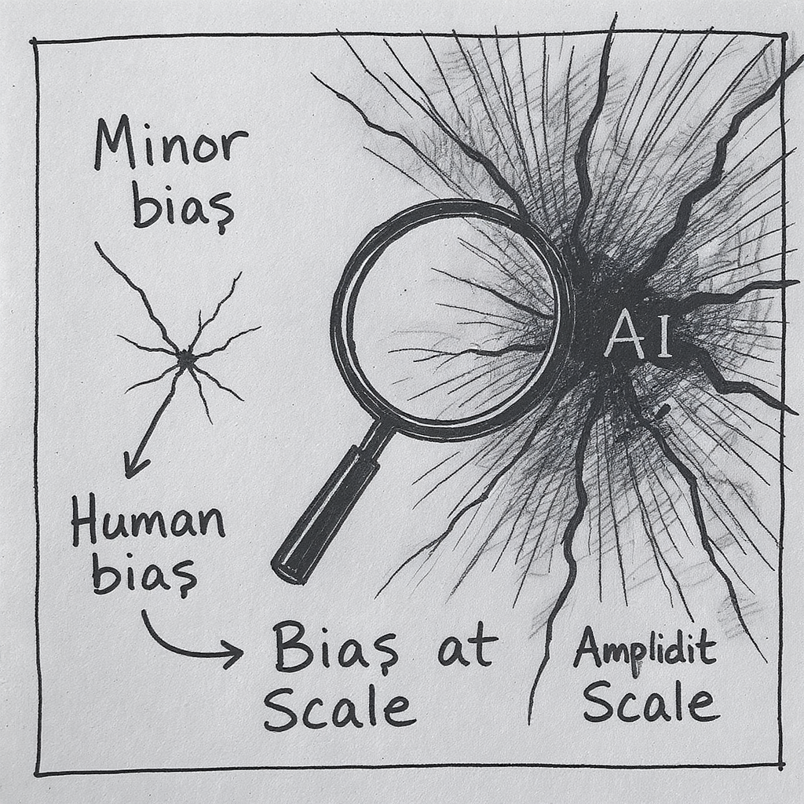

::: {.notes}

**Traditional IT:**

- Human biases, limited scale

**AI:**

- Learns biases from historical data
- Applies at **massive scale**
- Hidden in model

**One biased AI = Millions of biased decisions**

Budget 10-30% for bias testing, diverse teams, monitoring
:::

---

# The 5 AI-Specific Criteria

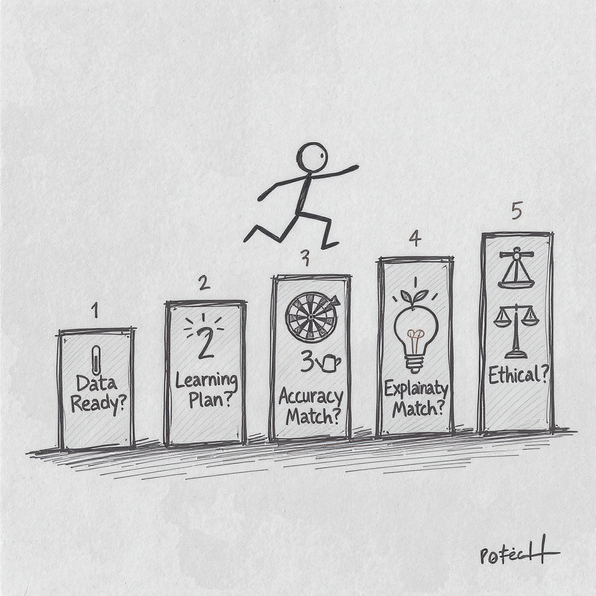

::: {.notes}
Every AI investment must answer:

1. **Data Readiness** - Score 0-10, need ≥7?
2. **Continuous Learning** - 30-50% ongoing cost budgeted?
3. **Accuracy vs. Risk** - Does AI capability match requirements?
4. **Explainability** - Can we explain decisions (if required)?
5. **Ethical Risk** - Have we tested for bias?

**Must pass BOTH traditional AND AI-specific criteria**
:::
---

# Framework 1: AI Transformation Matrix

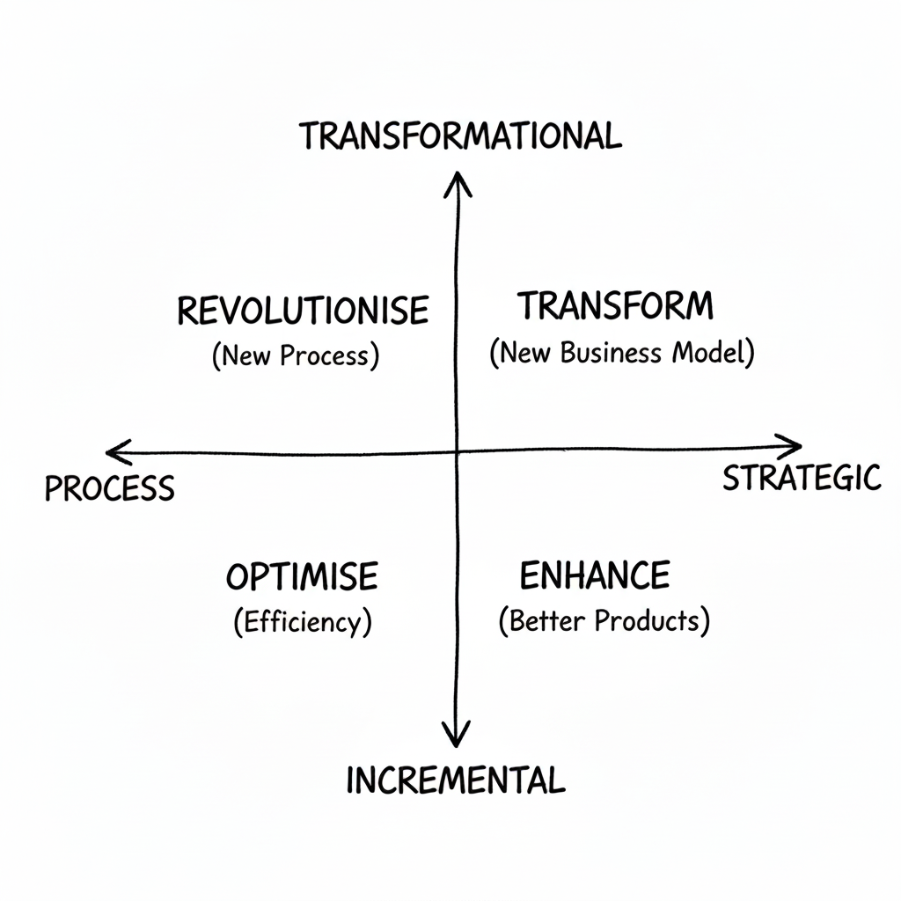

::: {notes}

**Four Quadrants of AI Impact:**

**Classify AI initiatives:**

- **OPTIMIZE** (Process + Incremental): Efficiency
- **ENHANCE** (Strategic + Incremental): Better products
- **REVOLUTIONIZE** (Process + Transformational): New processes
- **TRANSFORM** (Strategic + Transformational): New business models

**Most organizations:** 80% in OPTIMIZE quadrant

**Use:** Identify portfolio balance and gaps

- The Innovation Adoption Framework provides a roadmap for implementing AI in organisations
- Phase 1 is Knowledge Building - understanding what's possible before making commitments
- Phase 2 is Strategic Alignment - connecting AI initiatives to specific business objectives
- Phase 3 is Capability Development - building or acquiring the needed skills and technologies
- Phase 4 is Pilot Implementation - testing in controlled environments to demonstrate value
- Phase 5 is Organisational Transformation - scaling successful approaches across the business
- The Digital Agriculture Services example illustrates this progression
- They began by building knowledge about how satellite imagery and ML could predict crop yields
- They aligned this with strategic business needs in agricultural insurance and investment
- They developed capabilities by building data science teams and satellite imagery processing
- Their pilot implementations tested predictions against ground-truth data in specific regions
- Now they're transforming the agricultural intelligence landscape at organisational scale
- This framework applies to any significant innovation initiative, not just AI
- The key insight: skipping phases often leads to implementation failure
- Many organisations jump straight to pilots without strategic alignment or capability building
- The KPMG framework provides additional detail on implementing each phase
- What phase is your organisation currently in? Are you trying to skip essential steps?

:::

---

# Framework 2: Data Value Pyramid

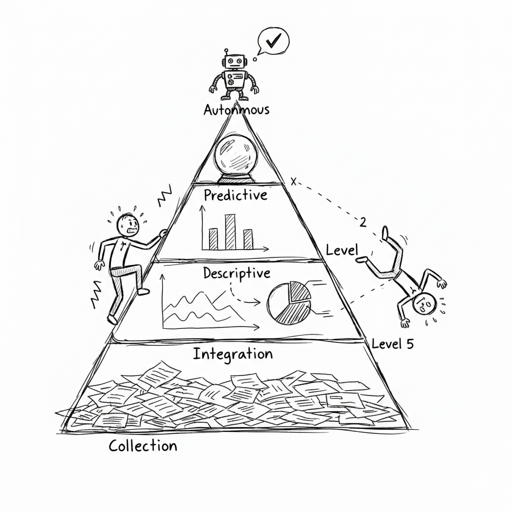

::: {.notes}
**5 Levels of Data Maturity:**

- Level 5: **AUTONOMOUS** - AI decides and acts
- Level 4: **PREDICTIVE** - Forecast what will happen
- Level 3: **DESCRIPTIVE** - Understand what happened
- Level 2: **INTEGRATION** - Connect data sources
- Level 1: **COLLECTION** - Gather raw data

**You cannot skip levels**
:::

---

# Match AI to Data Maturity

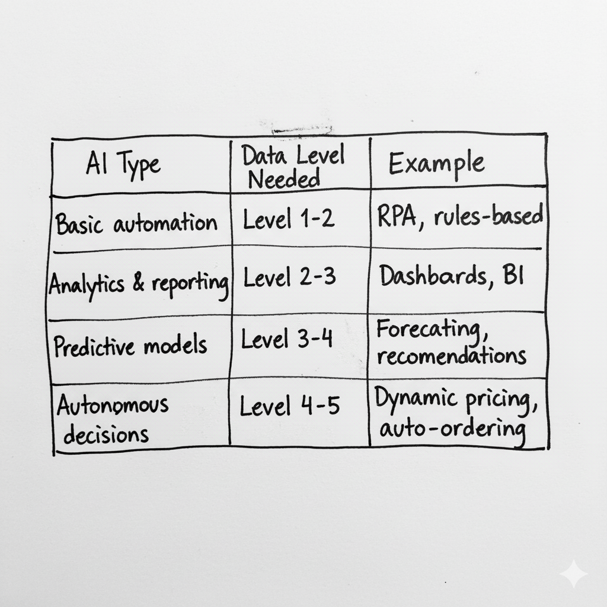

::: {.notes}
AI Type | Data Level Needed | Example
--------|-------------------|----------
Basic automation | Level 1-2 | RPA, rules-based
Analytics & reporting | Level 2-3 | Dashboards, BI
Predictive models | Level 3-4 | Forecasting, recommendations
Autonomous decisions | Level 4-5 | Dynamic pricing, auto-ordering

**Assess data maturity BEFORE funding AI**
:::

---

# Why 85% of AI projects fail

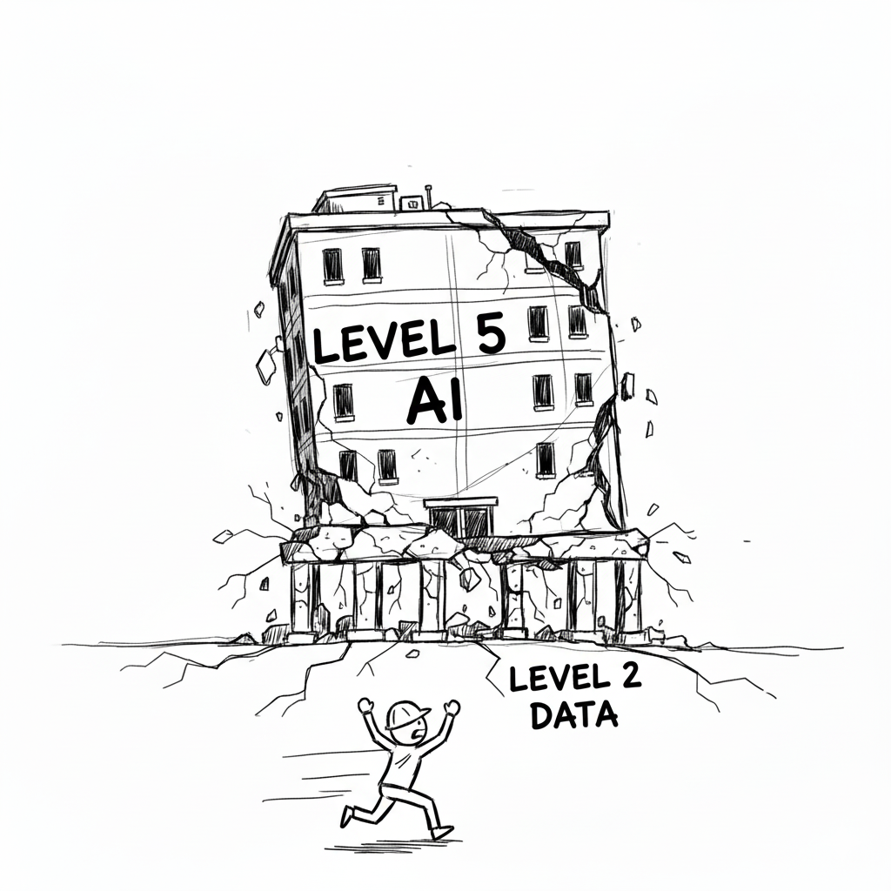

::: {.notes}
**If you're at Level 2, you cannot do Level 5 AI**

You will fail.

**Most organizations:**

- Current state: Level 2-3
- AI ambition: Level 5

- **Gap = Why 85% of AI projects fail**
:::
---

# Exercise 1: AI Tech Radar

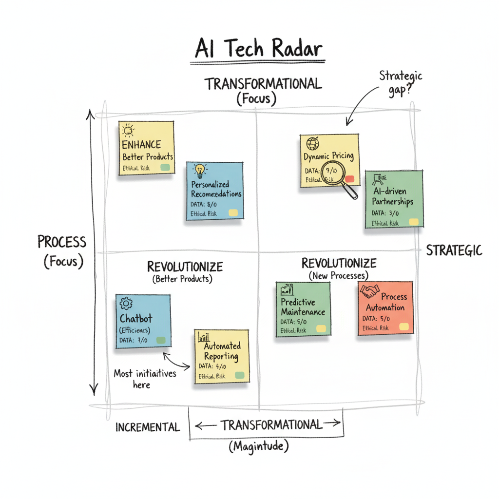

::: {.notes}

**Your Task (in table groups):**

1. Map AI capabilities on Transformation Matrix
2. Assess data readiness for each (0-10 score)
3. Flag ethical risks (HIGH/MED/LOW)

**Output:** Where are you today? Where are gaps?

:::

---

# Break

---

# Framework 3: Three Horizons Model

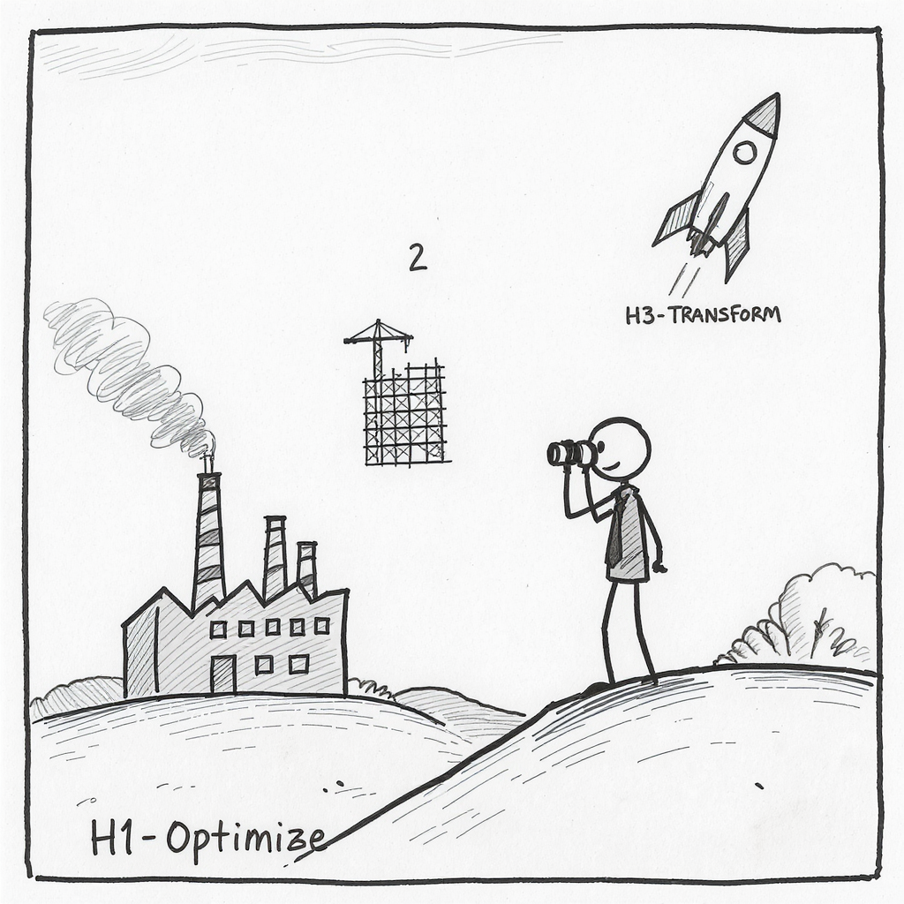

::: {.notes}

Balance AI portfolio across timeframes:

- **Horizon 1** (0-12 mo): Optimize core - **70%** of budget
- **Horizon 2** (1-3 yrs): Build emerging - **20%** of budget
- **Horizon 3** (3-5+ yrs): Create future - **10%** of budget

All H1 = No future | All H3 = No present
:::

---

# Portfolio Balance

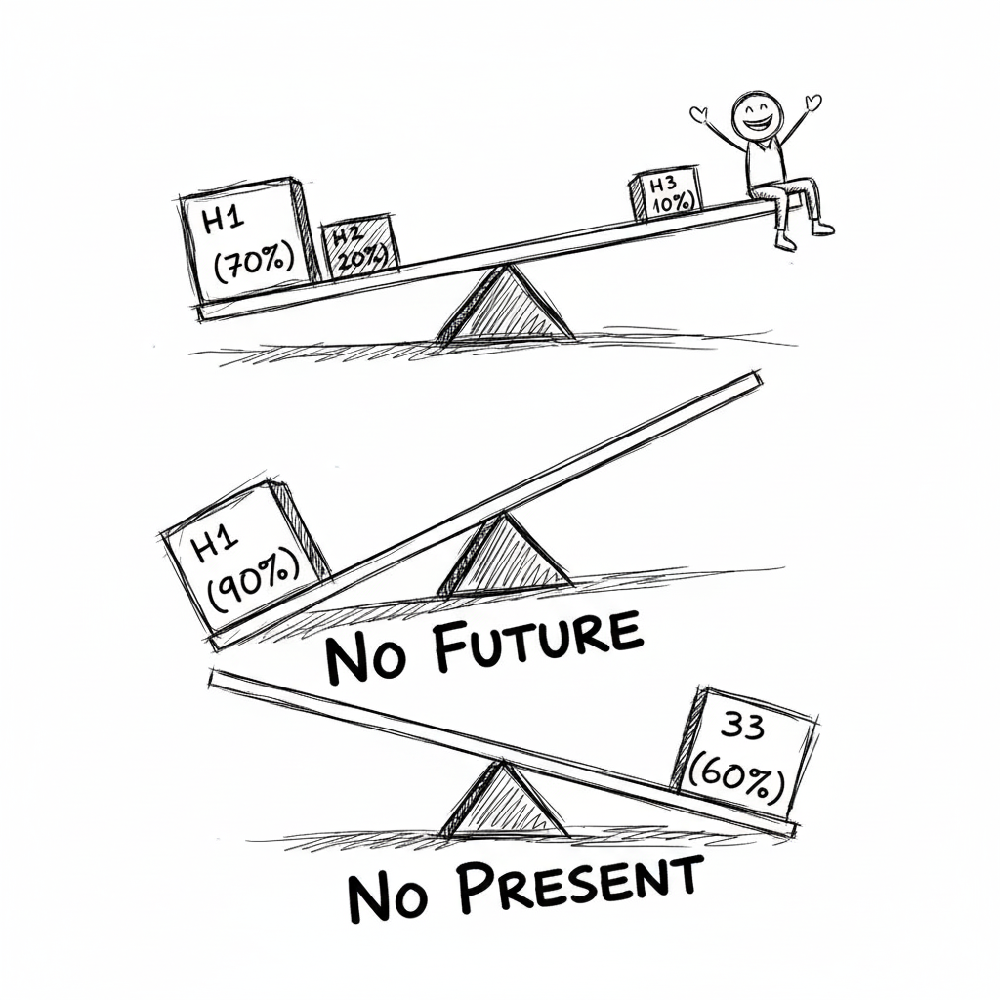

::: {.notes}
**Most organisations get this wrong:**

1. **All H1 (80%+ optimize):** Efficient today, irrelevant tomorrow
2. **All H3 (50%+ moonshots):** Exciting vision, no cash flow

**Right balance:** 70/20/10

Audit your AI portfolio: Are you balanced?
:::

---

# Framework 4: Innovation Adoption Framework

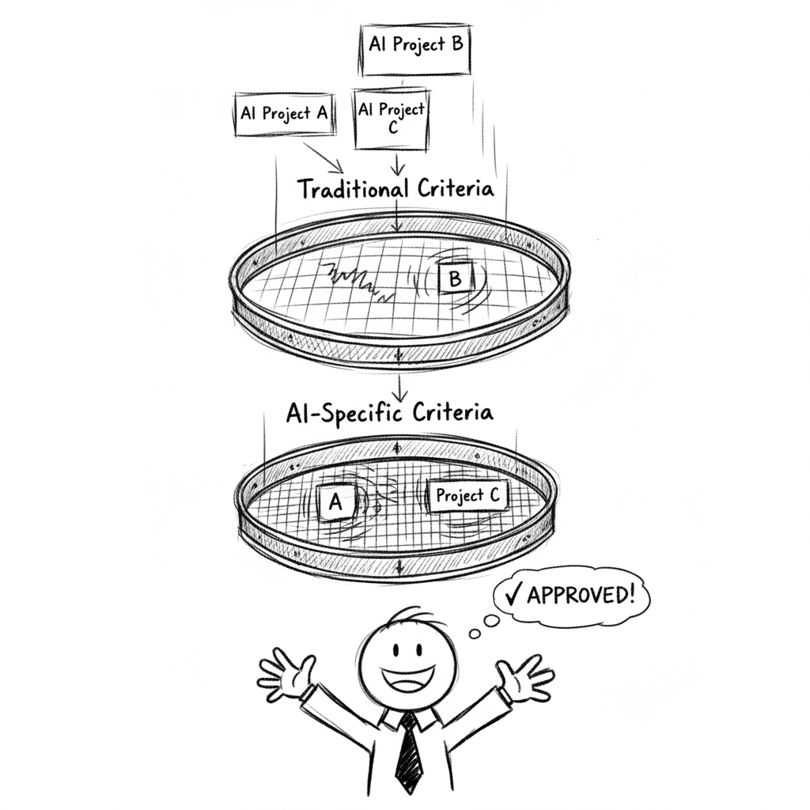

::: {.notes}
**Even great AI initiatives fail if people don't adopt them**

- Technical feasibility ✓
- Strong business case ✓
- **But:** 70% of digital transformation fails due to people resistance

**Must assess organizational readiness BEFORE investing**
:::

---

# The 5 Adoption Barriers

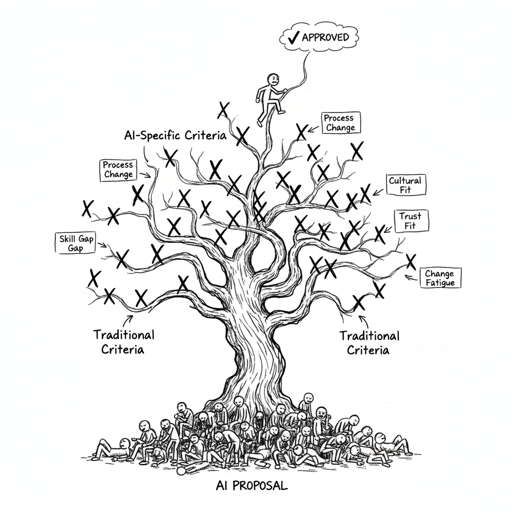

::: {.notes}

Every AI initiative faces resistance:

1. **Skill Gap** - Do people have required capabilities?
2. **Process Change** - How much disruption to workflows?
3. **Cultural Fit** - Does it align with organizational values?
4. **Trust** - Do people believe in the technology?
5. **Change Fatigue** - Are people exhausted from prior changes?
:::

---

# Adoption Readiness Assessment

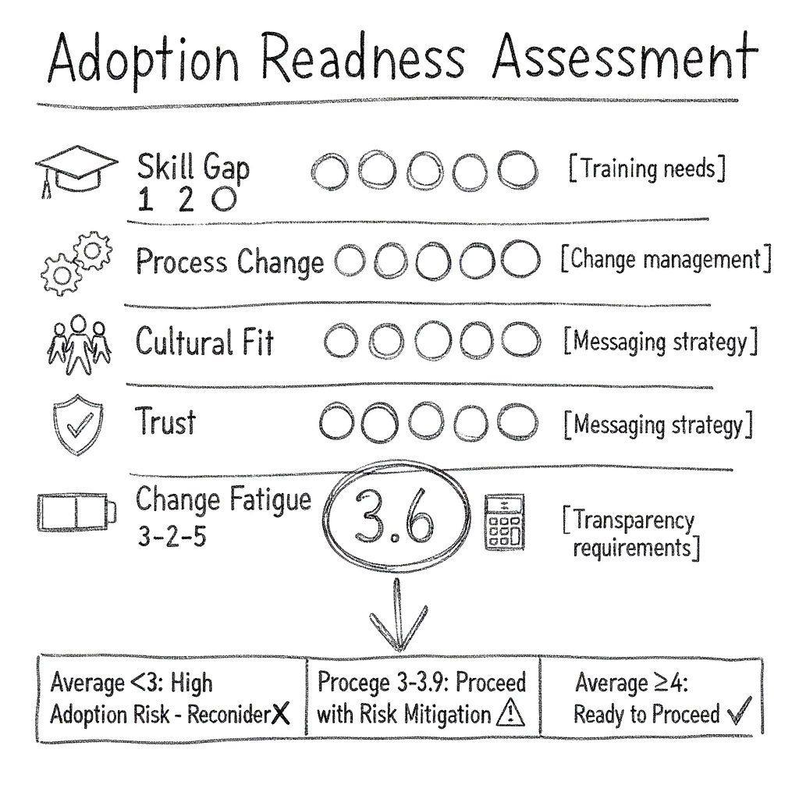

::: {notes}

**Score each barrier 1-5 (5 = low barrier, 1 = high barrier):**

Barrier | Score | Impact
--------|-------|--------
Skill Gap | ___ | Training needs
Process Change | ___ | Change management
Cultural Fit | ___ | Messaging strategy
Trust | ___ | Transparency requirements
Change Fatigue | ___ | Timing decision

- **Average ≥4:** Ready to proceed
- **Average 3-3.9:** Proceed with risk mitigation
- **Average <3:** High adoption risk, reconsider

:::

---

# Exercise 2: AI-Assisted Strategic Analysis

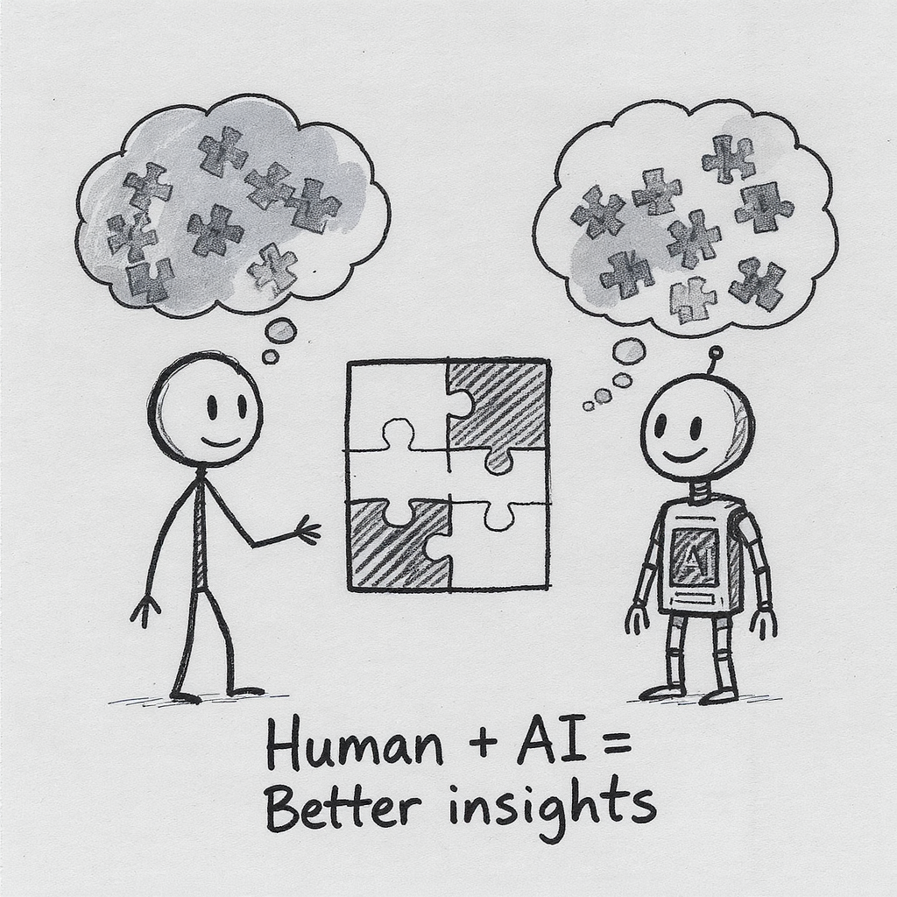

**Round 1: Risk Deep-Dive**
AI identifies threats you missed

**Round 2: Reverse Prompting**
AI asks YOU questions to reveal opportunities

**Round 3: AI Debate**
Two AIs argue different perspectives

::: {.notes}

**You'll use AI tools (ChatGPT/Claude/Gemini) for strategic thinking**

**Three phases:**

1. **Human Brainstorm** - Your thinking first
2. **AI Augmentation** - Use AI to go deeper
3. **Human Synthesis** - Compare & learn

:::

---

# Lunch

---

# Framework 5: AI Investment Model

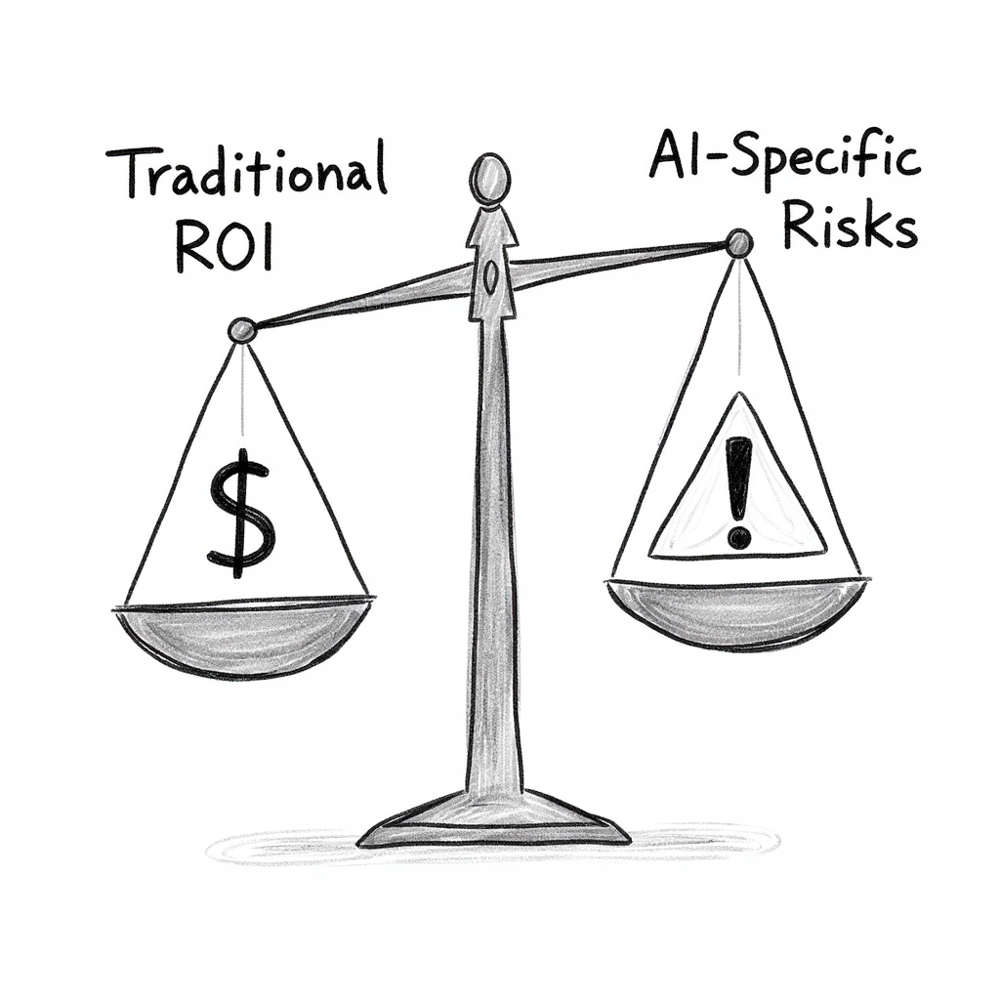

::: {.notes}

**Two-part evaluation:**

**Part A: Traditional Criteria**

- Strategic fit (Three Horizons, Transformation Matrix)
- Financial ROI (4 value categories)
- Implementation feasibility

**Part B: AI-Specific Criteria**

- Data readiness (0-10 score)
- Continuous learning plan
- Accuracy vs. risk tolerance
- Explainability requirements
- Ethical risk assessment
:::

---

# The 4 Value Categories

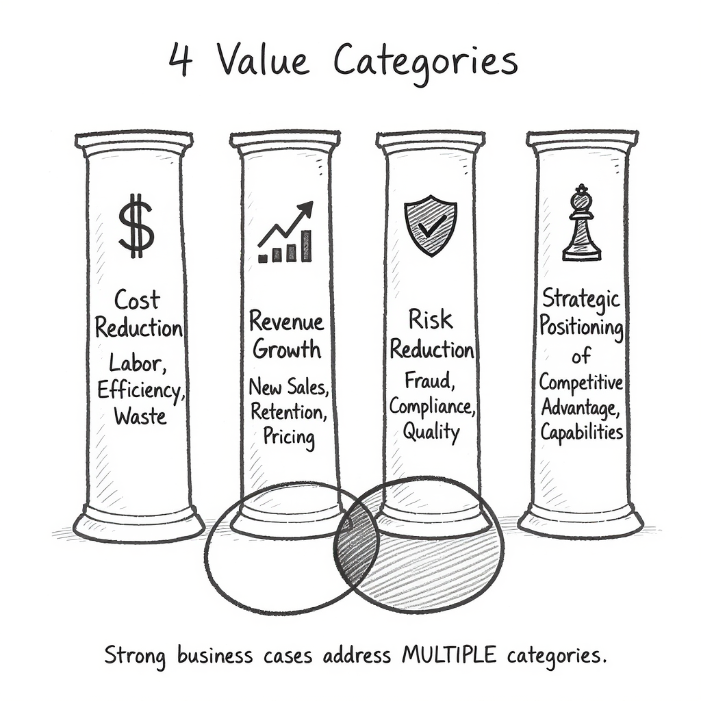

::: {.notes}
Every AI investment creates value across:

1. **Cost Reduction** - Labor, efficiency, waste
2. **Revenue Growth** - New sales, retention, pricing
3. **Risk Reduction** - Fraud, compliance, quality
4. **Strategic Positioning** - Competitive advantage, capabilities

Strong business cases address MULTIPLE categories
:::

---

# AI-Specific: The 5 Criteria

::: {.notes}

**1. Data Readiness (0-10)**

- Data availability, quality, access, bias
- If <7: Stop, fund data infrastructure first

**2. Continuous Learning (TCO)**

- Static (10-15%), Batch (25-30%), Real-time (35-50%)
- Calculate 5-year TCO, not just Year 1

**3. Accuracy vs. Risk Tolerance**

- Low stakes: 70-80% OK
- Medium: 85-95% needed
- High: 95-99%+ required

**4. Explainability**

- HIGH (regulated): Interpretable models only (+15-20%)
- MEDIUM (operational): Add explanation tools (+10-15%)
- LOW (consumer): Any algorithm OK

**5. Ethical Risk Assessment**

- HIGH (life-impacting): Extensive testing (+20-30%)
- MEDIUM (customer-facing): Bias testing (+10-15%)
- LOW (internal): Basic review (+5%)

Budget for bias testing, diverse teams, monitoring
:::

---

# The Strategic Dilemma

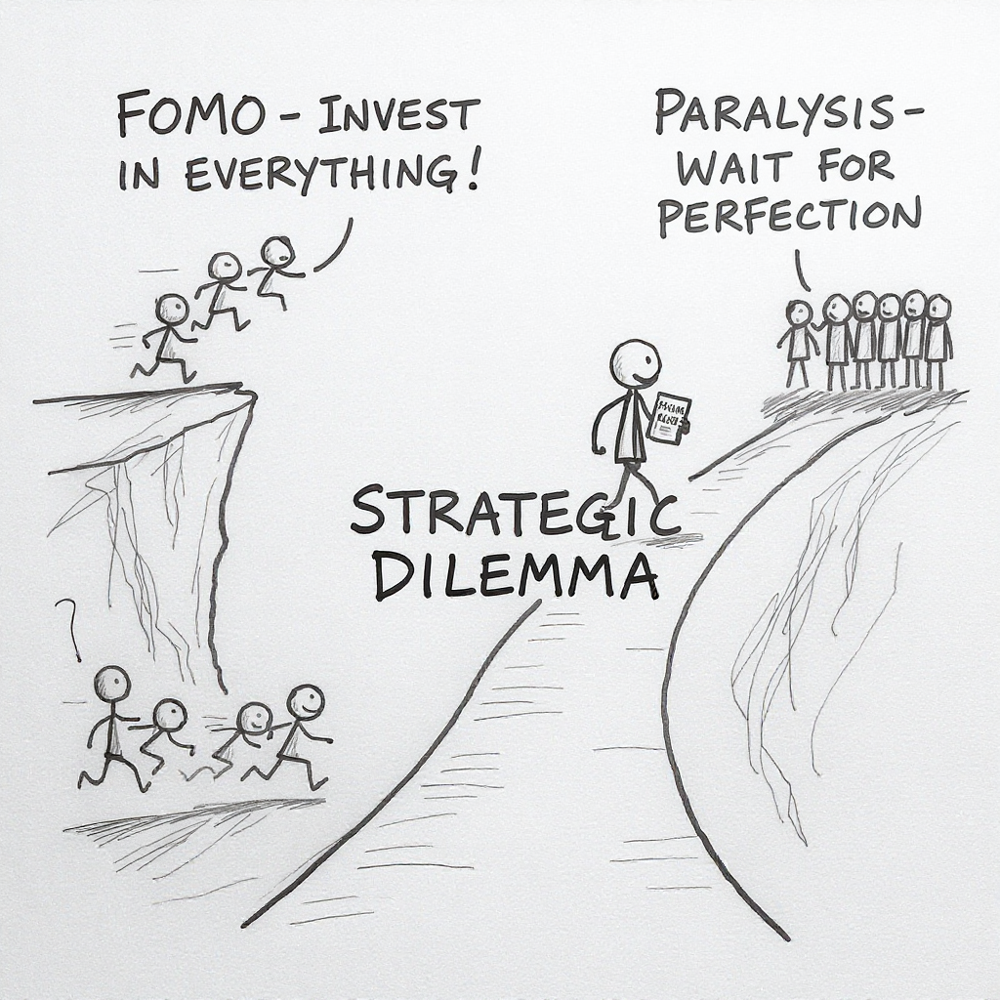

::: {notes}
**If you used ONLY traditional ROI:**

1. Fraud Detection: 315% ROI ← **Fund this**
2. Inventory: 264% ROI ← **Fund this**
3. Dynamic Pricing: 253% ROI ← **Maybe this?**
4. Chatbot: 92% ROI ← Don't fund

**But after AI-specific analysis:**

1. Fraud: Data not ready (need 6 months prep first)
2. Inventory: Exceeds budget cap
3. Dynamic Pricing: HIGH ethical/bias risk
4. Chatbot: Only one that's truly ready ✅

**Traditional criteria would fund the WRONG projects**

:::

---

# Break

---

# Exercise 3: Dragon's Den

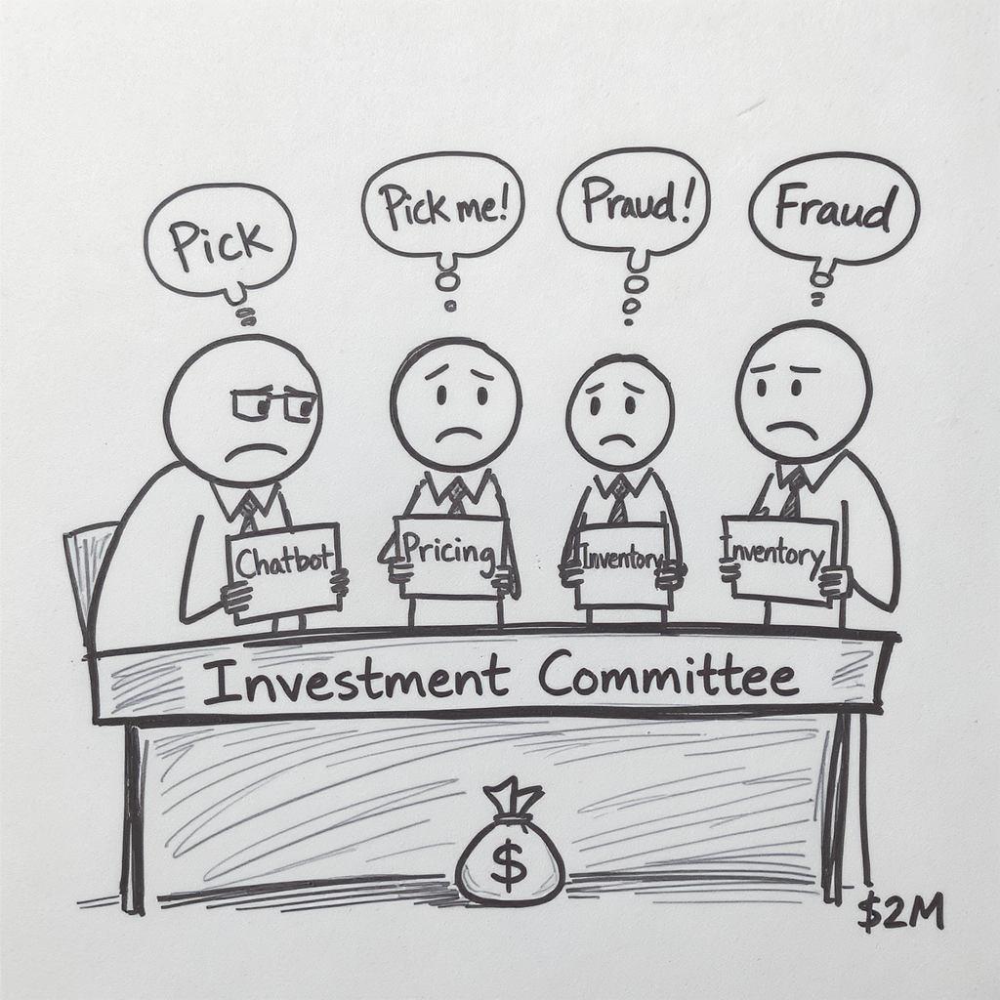

::: {.notes}
**Strategic stress test of the AI Investment Model:**

- RetailFlow has $2M budget, $2.95M in requests
- 4 competing initiatives, all with strong ROI
- You cannot fund everything
- **The test:** Do AI-specific criteria change your decisions?

**Your task:**

- Project teams: Build investment case using AI criteria
- Investment committee: Evaluate using complete framework
:::

---

# Exercise 4: Strategic Response Scenarios

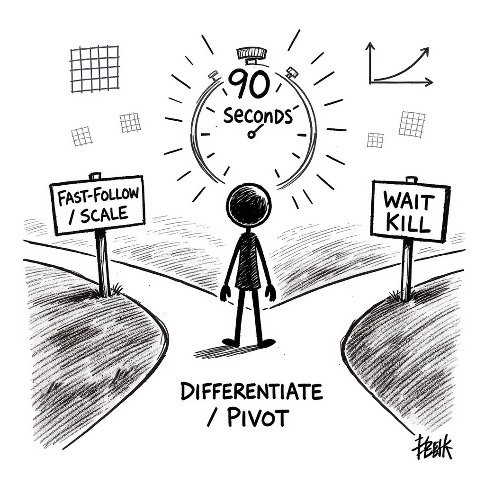

::: {.notes}

Three rapid-fire strategic decisions with anonymous voting (MS Forms). 

Apply frameworks to realistic dilemmas: competitive threats, pilot performance, emerging technology timing. 

:::

---

# What You Learned Today

::: {.notes}
**AI investments require DIFFERENT evaluation:**

1. **Data readiness gates everything** (6/10 = delay the project)
2. **Ongoing costs are 3-5x higher** (30-50% vs. 10-15%)
3. **Ethical risks are existential** (one biased AI = massive damage)
4. **Explainability isn't optional** (regulated industries)
5. **Highest ROI ≠ best investment** (must pass AI criteria too)
:::

---

# The Monday Morning Test

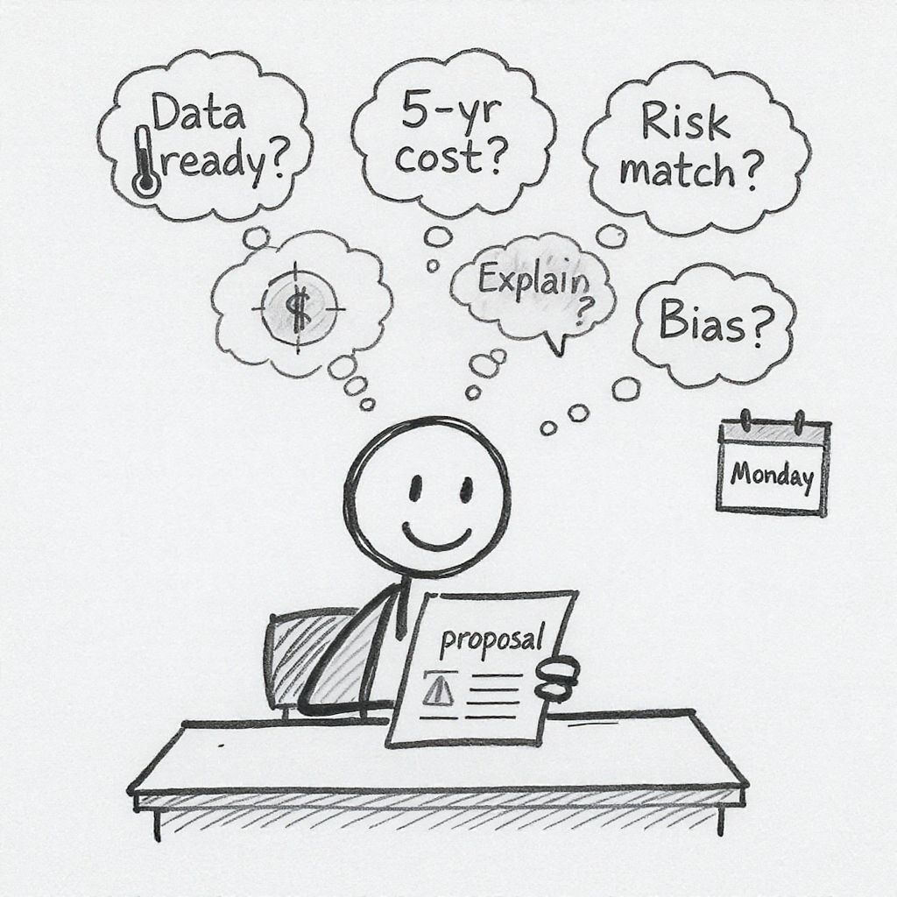

::: {notes}

**Next AI proposal you see, ask these 5 questions:**

1. **What's our data readiness score?** (0-10, need ≥7)
2. **What's the 5-year TCO?** (not just Year 1 build cost)
3. **What's the cost of being wrong?** (accuracy requirement)
4. **Must we explain AI decisions?** (regulatory/trust)
5. **Could this discriminate?** (bias testing plan)

**If they can't answer all 5, you're not ready to approve**

This is your new governance standard.
:::

---

# The 5 Frameworks: Summary

**Framework 1: AI Transformation Matrix** - Portfolio balance

**Framework 2: Data Value Pyramid** - Match AI to data maturity

**Framework 3: Three Horizons Model** - Balance across timeframes

**Framework 4: Innovation Adoption** - Organizational readiness

**Framework 5: AI Investment Model** - Traditional + AI-specific criteria

---

# Thank You

Please take the survey

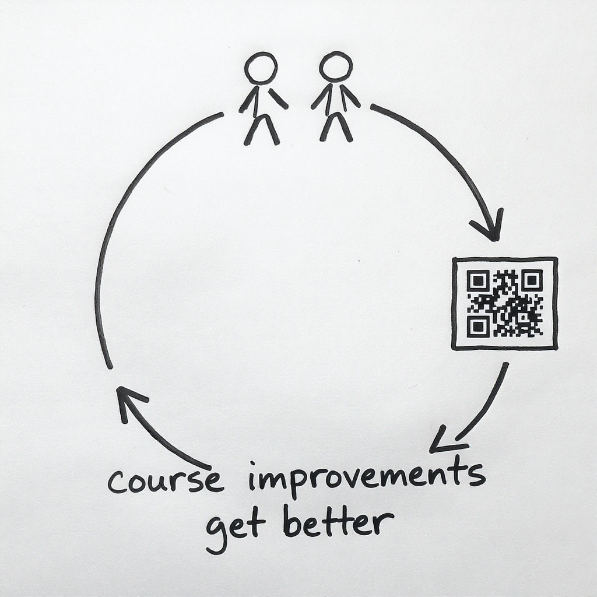

**Contact:** michael.borck@curtin.edu.au

**Materials:** https://exec-ed.github.io/ai-business-innovation/

::: {.notes}
**You now have:**

- ✅ 5 strategic frameworks
- ✅ AI Investment Checklist
- ✅ Understanding of what makes AI different

**Use them Monday morning.**
:::

